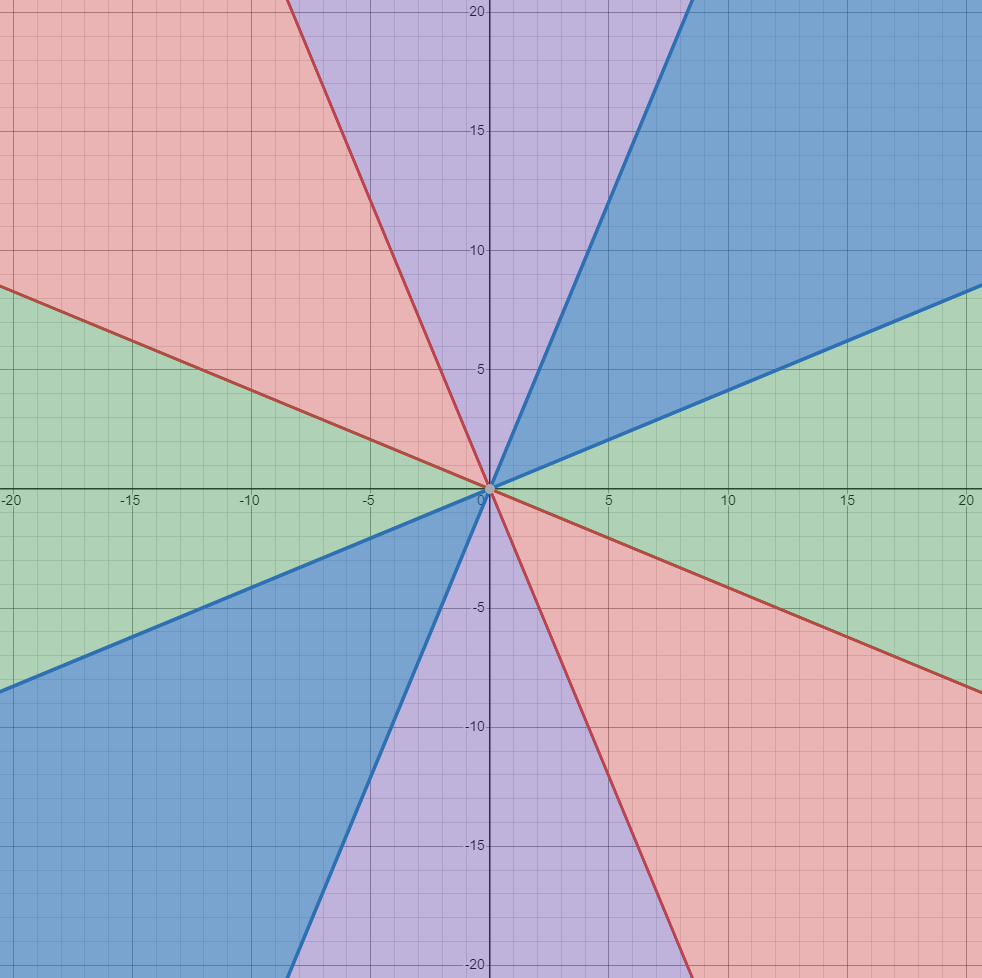

# 2023 FPGA Hackathon
I participated online in a 24h hackathon organised by Nokia in Krakow this year. The event wasn't so much a hackathon but rather a coding competition exclusively for FPGAs.
I registered with two other friends but for life reasons they both had to drop out near the beginning of the competition. Despite this I completed 7 of the 10 tasks because it was fun and I wanted to learn. For this reason I also decided not to spend the full 24 hours on this competition but only my free time.

## The tasks
There were ten tasks related to the theme of rescueing a Mars colony town which suffered from technical problems. We were handed a Quartus project with a project already set-up with lots of scaffolding for the judge system. This made it so we could focus on small self-contained problems which made it a whole lot easier. On top of that, there were no requirements or points to win for efficient implementations. It is still more fun to aim for one though.
I have only had experience with VHDL, but the template solutions were written in SystemVerilog. Luckily the provided scaffolding made this no problem. It turns out that there's pretty much a 1-to-1 mapping between VHDL and SystemVerilog at least when it comes down to actual implementations. I can image the differences are much larger for project organisation and validation. 
The tasks themselves weren't difficult either. Solving them in a regular programming language would take just a couple minutes. The more difficult part was getting it to run on an fpga e.g. timing constraints, pipelining and math with real numbers.

### Problem 1
The problem statement asks to calculate gray values from 24-bit RGB using the Y'IV/Y'IQ model.

$$ Y = 0.299R + 0.587G + 0.114B $$

The result of the exact calculation should be rounded to the nearest integer to return it as a byte.

This was straightforwardly solved by using 14 extra fractional bits (we need at least 10 for the 3 fractional digits). The rounding can be accomplished by adding $0.5$ right before truncating the fractional bits.

$$ Y = (0.299 \cdot 2^{14})R + (0.587 \cdot 2^{14})G +(0.114 \cdot 2^{14})B\gg 14 $$

### Problem 2
The input was a 5x5 square of bytes. We were tasked to return the 9 3x3 overlapping windows in turn within the input.
The input didn't need any processing so this was simple indexing, with a loop which increments the start point of the window each cycle.

### Problem 4
We were tasked with returning a 3-bit enumeration of the octants an $(x, y)$ input vector belongs to.  

The problem statement deliberately included the formula

$$ \phi = \arctan(\frac{y}{x})  $$

as a suggestion for the algorithm. There are however easier integer math ways of doing this calculation.
The angle between two vectors can be easily calculated with the dot product between the two.

$$ v \cdot u = \left| v \right| \left| u \right| \cos(\phi) $$

$$ \cos(\phi) = \frac{v \cdot u}{\left| v \right| \left| u \right|} $$

If $\cos(\phi) < \cos(\frac{2\pi}{8})$ = C. 
The way it's written now still requires a lot of fractional math: $\sqrt{}$ for the vector lengths and divisions to normalize. It turns out we can avoid all this by looking at the axes first.
The dot product with an axis $v \cdot y$ is just the corresponding component of the vector: $v_y$ . The length of the axis is $1$ thus the computation becomes

$$\cos(\phi) = \frac{v_y}{\left| v \right|} < C $$

The division is removed by multiplying both sides with $\left|v\right|$ and now we're the difficult operation left is the norm.

$$v_y < C\left| v \right| = C\sqrt{v_x^2 + v_y^2}$$

We can square both sides to remove the square root. By squaring, the new equation gains an extra solution. Luckily for us this is even better, because now we capture the opposite side of the cone in the same equation!

$$v_y^2 < C^2(v_x^2 + v_y^2)$$

Now we're left with two integer multiplies, and multiplication with a constant which we can easily perform in fixed-point with the necesarry resolution.
At this point we can determine whether a vector lies in the x-axis or y-axis octants, but we still need to take care of the diagonals. This becomes simple now that we can know if a vector DOESN'T lie in the x or y cones because we can look at the normal quadrants.

If the sign of x and y differ, it's in the green quadrants, otherwise purple. The differing sign is checked with an XOR between the sign bits. 

### Problem 5
This problem had provided code with an error. The code's purpose was to encode a binary number into a BCD.
The code consisted of a three-process state machine for the conversion. The first one determined the next_state, the second one loaded next_state into state, and the third one did the operations.
The bug was that both the next_state calculation and loading the next_state were synchronous with the clock. This meant that the actual state change happend on the second clock cycle after the decision instead of the first. This results in operations being done too many times, unexpected and inconsistent state changes, and general weird behaviour.

### Problem 8
Given a complex (single precision float) $A$, $B$ and $\omega$, calculate the FFT Butterfly unit:

$$ \begin{cases}
A' = A+\omega B \\
B' = A-\omega B
\end{cases}
$$

I calculated this with 4 float multipliers and 2 adders and subtractors each by converting the calculations to real math.

$$
C = (\omega_{re}B_{re} - \omega_{im}B_{im}) + (\omega_{im}B_{re} + \omega_{re}B_{im})i
$$

$$
\begin{cases}
A' = (A_{re}+C_{re}) + (A_{im} + C_{im})i \\
B' = (A_{re}-C_{re}) + (A_{im} - C_{im})i \\
\end{cases}
$$

### Problem 9
Calculate $\frac{1}{\sqrt{x}}$ where the inputs are single precision floating-point. The solution was really simple once I found the correct IP core in the Quartus library. There was a core which did this calculation directly. I only had to wrap it in acounter before asserting the **valid** signal because the core took a couple of cycles.
Finding this IP core took me multiple hours though. Searching the built-in IP browser for _floating_ or  _fpu_ only resulted in a Nios FPU core. I tried to use this but I couldn't find documentation anywhere and it didn't produce the right result for an unknown reason. After this I found the ALTFP_\* cores which had an ALTFP_INV_SQRT ready to go. When I tried to instantiate this however, the Wizard splash screen progress bar would show up, but then nothing happend. I had to google a long time before I found that I had to go through the *FP_FUNCTIONS Intel FPGA IP* IP core wizard where I could then select the INV_SQRT functionality.

### Problem 10
Demodulate an _analog_ 16-bit QAM measurement into a 4-bit digital value. Solved by comparisons seperate comparisons on the I and Q parts then mapping into the requested symbols.
